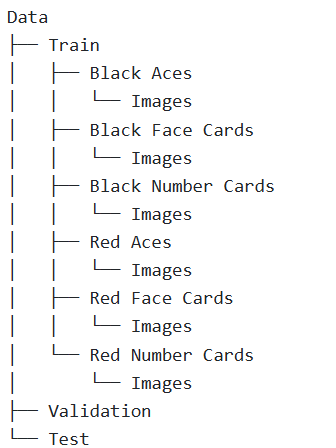

# Card-Classifier
DSCI 410 project to classify pictures of playing cards into one of six classes (red aces, red face cards, red number cards,black aces, black face cards, black number cards).

## Project Purpose
The overarching purpose of this project is to experiment with image classification and the more specific purpose is to correctly classify images of playing cards from a variety of decks into 6 distinct classes. This is an interesting project for me because I enjoy playing card games and it's always interesting to see how different decks design their cards while still being identifiable to people. I am also interested in trying to train a model with uneven class sizes and seeing how that may effect the model and accuracy. 

## Data Overview
The dataset I am planning to use is one I found on Kaggle (https://www.kaggle.com/datasets/gpiosenka/cards-image-datasetclassification/data). The dataset is broken into a training, testing, and validation set already with each image already being classified based on suit and rank. I changed these classifications by combining the folders until I was left with the 6 classes listed above in each of the data sets.

## Model Training Instructions
Make sure the data is formated  

## Results

## Limitations
