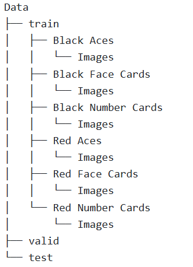

# Card-Classifier
DSCI 410 project to classify pictures of playing cards into one of six classes (red aces, red face cards, red number cards,black aces, black face cards, black number cards).

## Project Purpose
The overarching purpose of this project is to experiment with image classification and the more specific purpose is to correctly classify images of playing cards from a variety of decks into 6 distinct classes. This is an interesting project for me because I enjoy playing card games and it's always interesting to see how different decks design their cards while still being identifiable to people. I am also interested in trying to train a model with uneven class sizes and seeing how that may effect the model and accuracy. 

## Data Overview
The dataset I am planning to use is one I found on Kaggle (https://www.kaggle.com/datasets/gpiosenka/cards-image-datasetclassification/data). The dataset is broken into a training, testing, and validation set already with each image already being classified based on suit and rank. I changed these classifications by combining the folders until I was left with the 6 classes listed above in each of the data sets.

## Model Training Instructions
Make sure the datasets are formatted in the correct folder structure, A folder containing three folders named test, train and valid. in each of these three folders are folders of each class and in the folders of each class are the images for that class. An example of the correct structure is in the image below.

Also important that the folders and files in dataset and model folders are formatted the same way as they are on GitHub.

Then in a '.py' script or a Jupyter Notebook, import the `Trainer` class from 'train_models.py' (may need to import os and sys depedning on location importing to). Assign Trainer class to a variable with base_path argument set to file path to data folder  trainer = Trainer(base_path='/projects/Data'). 

Optional arguments for Trainer class include:  
input size - number of input channels (default = 3)    
output_size - number of classes for model to predict (default = 6)      
random_seed - seed for replicability (default = None)    
epochs - number of epochs to train for (default = 15)    
loss_fn - loss function to use (default = torch.nn.CrossEntropyLoss())  
reg_param - the L2 regularization applied to the optimizer (default = 0.001)  
lr - learning rate (default = 1e-3)    
batch_size - batch size for data loader (default = 128)  

Finally store the trained model along with the loss and accuracy for the training, validation, and test sets by calling the train_conv_model method of the Trainer

Example jupyter notebook can be found here [notebooks/eval_from_scratch.ipynb](https://github.com/Lwarrine/Card-Classifier/blob/main/notebooks/eval_from_scratch.ipynb)

Another example usage

import model.train_models.py
trainer = Trainer(base_path='/projects/dsci410_510/Luke_Card_Classifier', random_seed = 12)
model, train_losses, train_accuracies, valid_losses, valid_accuracies, test_losses, test_accuracies = trainer.train_conv_model()

## Results

## Limitations
